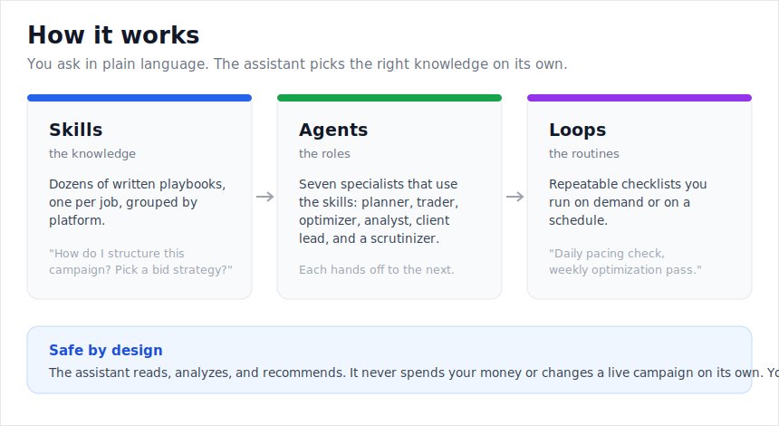
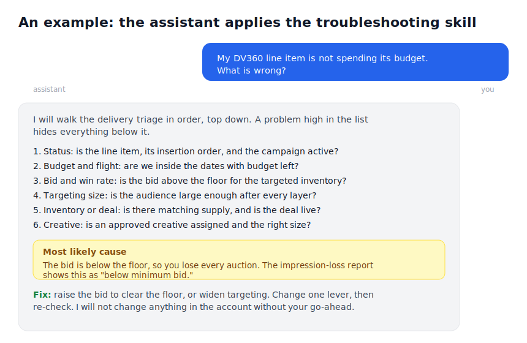
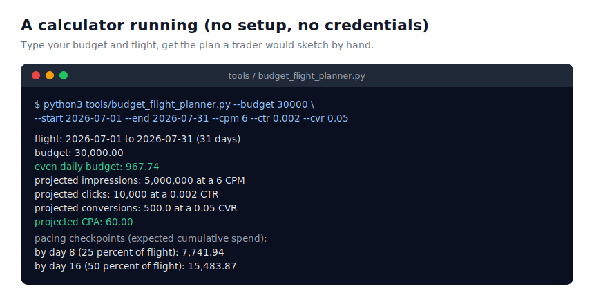

# Programmatic Skills

Run advertising campaigns like a seasoned programmatic trader by talking to your AI assistant
in plain language. This is an open library that teaches an AI assistant (in Claude Code, Codex,
and similar tools) the real decision rules, checklists, and steps an experienced trader,
analyst, and ad-operations specialist uses, across five major advertising platforms.

## The problem it solves

Programmatic advertising means buying digital ads automatically through live auctions, across
platforms like Google's Display & Video 360, Google Ads, Amazon DSP, StackAdapt, and The Trade
Desk. Each platform has its own rules, its own jargon, and its own ways to go wrong, and the
knowledge to run them well lives in the heads of a few experienced people.

If you ask a general AI assistant a real trading question ("why is my campaign not spending?",
"which bid strategy should I use?", "build me a plan for a fifty thousand dollar video
campaign"), it tends to give generic or slightly wrong answers, because it does not know the
specifics of each platform.

This library fixes that. It gives the assistant the expert's playbook, so its answers match
what a senior trader would actually do.

## How it works, in plain language

Think of it as three layers.

1. **Skills are the knowledge.** Each skill is a short written playbook for one job: how to
   structure a campaign, how to choose a bid strategy, how to read a report, how to find why a
   campaign is not delivering. When your question matches a skill, the assistant reads that
   playbook and follows it. There are dozens of them, grouped by platform.
2. **Agents are the roles.** Seven ready-made specialists that use the skills: a media planner,
   a trader who builds the campaign, an optimizer who improves it, an account-operations
   specialist, a reporting analyst, a client-communications lead who writes the client update,
   and a scrutinizer who double-checks the work before it goes out.
3. **Loops are the routines.** Repeatable checklists you can run on demand or on a schedule,
   like a daily pacing check or a weekly optimization pass.

There are also simple calculators that need no setup, and a guide for connecting the assistant
to your live accounts when you want it to read your real data.

You do not configure anything to start. You install it, then ask your assistant questions in
normal language, and it picks the right skill on its own.

## Why it works

- **It is based on real documentation, not guesses.** Almost every claim links to the platform's own official help page, and the few platforms with private documentation (notably The Trade Desk) are clearly marked as such.
- **It is safe by design.** The assistant reads, analyzes, and recommends. It never spends your money or changes a live campaign on its own. A person always approves any change. This matches what the ad platforms themselves allow today.
- **It checks its own work.** A built-in scrutinizer reviews reports and recommendations for math errors, overclaiming, and unsupported statements before they reach a client.
- **One way of working across five platforms.** The same agents and routines run on any of the platforms; only the platform-specific knowledge changes underneath.
- **It was reviewed by a panel of trader and ops experts** and their feedback was built in. See [docs/CRITIQUE-AND-ROADMAP.md](docs/CRITIQUE-AND-ROADMAP.md).

## See it in action

A few real examples of the difference it makes.

**"My DV360 campaign is not spending its budget. What is wrong?"** On its own, an assistant
guesses. With this library, it runs the troubleshooting playbook in the right order (status,
then budget and flight, then bid and win rate, then how narrow the targeting is, then
inventory, then the creative) and tells you the single binding cause and the fix, the way a
senior trader debugs it.

**"Build me a media plan for a fifty thousand dollar connected-TV awareness campaign."** The
planner agent produces a structured plan with the right success metric (reach and frequency,
not clicks), the right platform for CTV, a budget split, a flight, and a measurement plan, then
hands it to the scrutinizer to check before it reaches the client.

**"Compare these two buys for me."** The eCPM calculator converts a cost-per-click buy and a
cost-per-action buy to the same effective cost per thousand impressions, so you can compare
lines that were priced differently.

The panels below show how the pieces fit together, the assistant applying a skill, and a
calculator you can run yourself.

### The three layers



Skills hold the knowledge, agents are the specialist roles that use them, and loops are the
repeatable routines. Underneath it all, the assistant only recommends. A person approves any
change.

### The assistant applying a skill



Ask why a campaign is not spending, and instead of a generic answer the assistant walks the
same triage a senior trader uses (status, budget, bid, targeting, inventory, creative), then
names the one binding cause, here a bid below the floor, and the fix. It stops at a
recommendation and does not touch the account.

### A calculator you can run yourself



The simple calculators need no accounts and no setup. Give the budget and flight planner your
budget, your flight, and a target CPM, and it returns the daily budget, the impressions to
expect, and pacing checkpoints to catch drift early.

## Who this is for

Programmatic traders, ad-operations specialists, and analysts who want an assistant that
already knows the platforms, agencies that want consistent quality, and anyone learning
programmatic who wants the decision rules an experienced trader applies.

## What is in the box

A library of agent skills organized by platform, plus shared foundations and reporting, the
seven specialist agents, and the loop library. DV360, Google Ads, Amazon DSP, StackAdapt, and
The Trade Desk are covered today.

### Shared and cross-platform

| Skill | What it does |
| --- | --- |
| `programmatic-foundations` | Glossary, auction and KPI math, funnel model, and the trader, analyst, and ops mental model every platform skill builds on. |
| `reporting-by-campaign-goal` | State-of-the-art report recipes per objective: awareness, consideration, conversion, retention, and reach planning. |
| `path-to-conversion-analysis` | Multi-touch paths: touchpoints to convert, time lag, top paths, and assisted conversions, via CM360, GA4, and Ads Data Hub. |
| `dsp-selection` | Which demand-side platform to use for which goal, and the tradeoffs that decide it. |
| `reach-and-frequency-planning` | Deduplicated reach across platforms, effective frequency, the reach curve, and the identity limits. |
| `incrementality-and-experimentation` | Lift testing done right: conversion lift, geo lift, holdouts, power and sample size, reading a result. |
| `client-deliverable-templates` | Fill-in media plan, QBR deck, proposal, plain-English glossary, and bad-news framing for clients. |
| `value-based-bidding` | Feeding accurate conversion values (revenue, margin, LTV, new-customer value) so automated bidding optimizes to profit. |
| `bid-landscape-and-win-rate` | Reading the win-rate-by-bid curve to find the efficient bid, marginal CPA versus volume, first-price effects. |
| `marketing-mix-modeling` | What MMM is and when to use it, data needs, Meridian and Robyn, reading contribution and response curves. |
| `data-quality-and-reconciliation` | Why conversion numbers differ across tools, acceptable bands, pre-ship checks, and a real anomaly method. |
| `discrepancy-and-reconciliation` | Ad server versus DSP impression discrepancies, tolerance bands, make-goods, and a month-end close. |
| `tag-and-pixel-governance` | Floodlight and pixel setup and validation, Consent Mode, deduplication, and a pixel inventory and retirement policy. |
| `change-management-and-incident-response` | Maker-checker approvals, a bulk-edit pre-flight, and an incident runbook with severity tiers. |
| `partner-and-advertiser-onboarding` | A gated sequence from signed insertion order to first-campaign-ready, with billing and measurement checks. |
| `brand-safety-and-suitability` | Pre-bid versus post-bid, MFA and invalid traffic, suitability tiers, regulated categories, supply-path transparency. |
| `privacy-and-consent` | GDPR, CCPA and CPRA, Consent Mode, TCF, identity consent, and the cookieless and Privacy Sandbox state. |
| `trader-onboarding` | A week 1, 2, and 4 ramp through the library for a new trader, ending in a graded build. |
| `approval-and-escalation-governance` | Who approves what, escalation paths, service levels, and a trader capability model. |

### Display & Video 360 (DV360)

| Skill | Job | What it does |
| --- | --- | --- |
| `dv360-campaign-architecture` | Trading | Partner to advertiser to campaign to insertion order to line item structure, and when to split. |
| `dv360-bid-strategy` | Trading | Fixed, automated, and custom bidding. Target CPA, CPM, ROAS. Learning periods and pitfalls. |
| `dv360-targeting-and-audiences` | Trading | First-party and Google audiences, combination logic, geo, device, contextual, viewability and IVT. |
| `dv360-deals-and-inventory` | Trading | Open auction, PMP, Programmatic Guaranteed, Preferred Deals. Activation and non-delivery fixes. |
| `dv360-frequency-and-brand-safety` | Trading | Frequency caps, content and publisher exclusions, DoubleVerify and IAS, viewability standards. |
| `dv360-pacing-and-optimization` | Trading | Pacing modes, pacing math, under and over-delivery fix trees, impression loss diagnosis. |
| `dv360-youtube-and-video` | Trading | YouTube and video line items: skippable, non-skippable, bumper, in-feed, Shorts, CPV, and video reach campaigns. |
| `dv360-creative-trafficking` | Ops | Third-party tags, VAST, click macros, secure tags, and a creative QA checklist for what blocks a creative from serving. |
| `dv360-reporting` | Analytics | Offline vs instant reporting, report types, the metric and dimension glossary, scheduling. |
| `dv360-measurement-and-attribution` | Analytics | Floodlight, Campaign Manager 360, attribution models, Brand Lift, reach and frequency. |
| `dv360-advanced-analytics-adh` | Analytics | Ads Data Hub, privacy checks, BigQuery Data Transfer, joining first-party data. |
| `dv360-custom-bidding` | Analytics | Rule-based, script, and Ads Data Hub custom bidding. Scoring, attribution, staged rollout. |
| `dv360-account-setup-and-taxonomy` | Ops | Partner and advertiser setup, naming conventions, roles and permissions, governance. |
| `dv360-launch-qa` | Ops | Pre-flight QA checklist and sign-off workflow before any campaign goes live. |
| `dv360-troubleshooting` | Ops | Ordered playbooks for no delivery, pacing, win rate, viewability, creatives, conversions. |
| `dv360-api-and-sdf-automation` | Ops | DV360 API v4 resources, Structured Data Files v10, and a safe-to-automate matrix. |

### Google Ads

| Skill | Job | What it does |
| --- | --- | --- |
| `google-ads-account-structure` | Structure | Account and manager (MCC) hierarchy, campaign and ad group organization, the shared library, and limits. |
| `google-ads-campaign-types` | Structure | Search, Performance Max, Demand Gen, Display, Video, Shopping, and App, with an objective-to-type guide. |
| `google-ads-performance-max` | Campaigns | Asset groups, audience signals, listing groups, search themes, brand exclusions, and PMax versus Search. |
| `google-ads-bidding` | Bidding | Smart Bidding (tCPA, tROAS, maximize conversions or value), manual CPC, portfolio strategies, bid adjustments. |
| `google-ads-keywords-and-match-types` | Search | Broad, phrase, and exact match, negatives, the search terms report, and keyword research. |
| `google-ads-audiences-and-targeting` | Targeting | Audience segments, Customer Match, targeting versus observation, optimized targeting, content targeting. |
| `google-ads-budgets-and-pacing` | Budget | Average daily budgets, the 2x daily and monthly cap behavior, shared budgets, and limited-by-budget. |
| `google-ads-conversion-tracking-and-attribution` | Measurement | Conversion actions, Enhanced Conversions, Consent Mode, primary vs secondary, and attribution models. |
| `google-ads-reporting` | Analytics | The report editor, custom columns, segments, the impression-share metrics, scripts, and GAQL. |
| `google-ads-optimization-and-troubleshooting` | Ops | Optimization score, learning and limited statuses, disapprovals, low impression share, delivery fixes. |
| `google-ads-api-and-bulk-operations` | Automation | Google Ads API v24, GAQL, Editor, scripts, and a safe-to-automate matrix with a report puller. |
| `google-ads-shopping-and-feed` | Retail | Merchant Center, product feed quality and attributes, disapprovals, and Shopping versus Performance Max. |

### Amazon DSP

| Skill | Job | What it does |
| --- | --- | --- |
| `amazon-dsp-account-structure` | Structure | Advertiser, order, and line item hierarchy, managed vs self-service, product types, and the Amazon Ads pixel. |
| `amazon-dsp-campaign-setup` | Campaigns | Building orders and line items: supply, budget, pacing, flight, goal, frequency, dayparting, and targeting. |
| `amazon-dsp-audiences` | Targeting | Amazon shopping and streaming audiences, advertiser and AMC audiences, lookalikes, and ASIN retargeting. |
| `amazon-dsp-inventory-and-supply` | Supply | Amazon owned-and-operated (Prime Video, Fire TV, Twitch, IMDb), deals, and third-party exchanges. |
| `amazon-dsp-bidding-and-optimization` | Bidding | Optimization goals (reach, CPA, ROAS, VCR, DPVR), bid, supply, and audience optimization, and pacing. |
| `amazon-dsp-creative-and-formats` | Creative | Display, online video, streaming TV, audio, and responsive e-commerce creatives, and where to get specs. |
| `amazon-dsp-measurement-and-reporting` | Analytics | The retail funnel: detail page views, purchases, ROAS, new-to-brand, reach, frequency, and attribution. |
| `amazon-marketing-cloud` | Analytics | The AMC clean room: SQL on event-level signals, custom attribution, overlap, incrementality, and audiences. |
| `amazon-dsp-api-and-automation` | Automation | The Amazon Ads API for DSP, reporting and audiences APIs, the AMC API, access gating, and safe-to-automate. |

### StackAdapt

| Skill | Job | What it does |
| --- | --- | --- |
| `stackadapt-account-structure` | Structure | Account, campaign, ad group, and ad hierarchy across native, display, video, CTV, audio, and DOOH, and the pixel. |
| `stackadapt-campaign-setup` | Campaigns | Building a campaign and ad groups: channel, objective, budget, flight, pacing, bid, targeting, and creatives. |
| `stackadapt-targeting-and-audiences` | Targeting | Retargeting, lookalikes, third-party data, custom segments, and StackAdapt's contextual targeting. |
| `stackadapt-bidding-and-budgets` | Bidding | Automated and manual bidding, goal types, maximum bids, budget setting, and pacing. |
| `stackadapt-inventory-and-brand-safety` | Supply | Exchange and PMP supply, CTV inventory, exclusion lists, contextual avoidance, and verification. |
| `stackadapt-reporting-and-attribution` | Analytics | Reporting dashboards and exports, the pixel and event tracking, UTMs, and the attribution approach. |
| `stackadapt-optimization-and-troubleshooting` | Ops | Triage and symptom playbooks for delivery, pacing, performance, creatives, and conversion tracking. |
| `stackadapt-api-and-automation` | Automation | The StackAdapt GraphQL API (request-only access), reporting, and a safe-to-automate matrix. |

### The Trade Desk

The Trade Desk's operational knowledge base and API reference sit behind a partner login, so
these skills are written at the public-concept level from TTD's public pages and the open
Unified ID 2.0 documentation. They state the model and flag where exact menus, fields, and
numbers must be confirmed in the partner platform, rather than inventing specifics.

| Skill | Job | What it does |
| --- | --- | --- |
| `ttd-platform-overview` | Overview | What The Trade Desk is, the independent open-internet DSP, Kokai, Koa AI, channels, and routing. |
| `ttd-campaign-structure` | Structure | The account and campaign hierarchy and where settings live, at the public concept level. |
| `ttd-targeting-and-audiences` | Targeting | First and third-party data, the data marketplace, contextual, and seeds, with specifics flagged. |
| `ttd-bidding-and-optimization` | Bidding | Koa AI valuation, seeds and bid factors, predictive clearing, Performance mode, and forecasting. |
| `ttd-inventory-and-deals` | Supply | Open market, private marketplace, Programmatic Guaranteed, and the OpenPath supply path. |
| `ttd-identity-and-uid2` | Identity | Unified ID 2.0 and EUID: tokens, operators, refresh, integration paths, and OpenPass. |
| `ttd-measurement-and-reporting` | Analytics | Reporting and attribution concepts, with the gated platform specifics flagged. |
| `ttd-api-and-automation` | Automation | The partner-gated TTD API model and a safe-to-automate posture. |

## Specialist agents

The package also ships specialist agents that use the skills above to run a full workflow.
Installed with the plugin they are auto-discovered, and you can call one by name.

| Agent | Role |
| --- | --- |
| `media-planner` | Turns a brief into a media plan: objective, KPI, audience, inventory, budget, and measurement. |
| `programmatic-trader` | Builds the campaign from the plan: structure, bidding, targeting, deals, frequency, pacing. |
| `optimization-specialist` | Optimizes and troubleshoots in flight, one lever at a time, with expected impact. |
| `account-operations-specialist` | Sets up the account, enforces taxonomy, runs launch QA, and handles safe bulk operations. |
| `reporting-analyst` | Builds the right report per goal and runs measurement, attribution, and path to conversion. |
| `client-communications-lead` | Translates results into clear, honest, client-ready communication. |
| `qa-scrutinizer` | Independent reviewer that scores and gates builds, reports, and client comms before they ship. |

A typical flow: `media-planner`, then `account-operations-specialist` to set up, then
`programmatic-trader` to build, then `optimization-specialist` in flight, then
`reporting-analyst` and `client-communications-lead` to report, with `qa-scrutinizer`
reviewing at each gate.

## Loop library

The `loops/` folder is a catalog of repeatable agent loops for daily and weekly trading and
reporting work: a pacing sweep, an optimization pass, a pre-launch QA gate, budget reallocation,
creative fatigue, anomaly detection, search-term mining, brand-safety monitoring, client
reporting, and business-review prep. Each loop is a bounded feedback cycle with an observable
success gate and a named stopping condition. Every loop monitors and recommends rather than
spending on its own, and any change is gated on human approval. See
[loops/README.md](loops/README.md) for the catalog and how to run a loop on demand or on a
schedule.

## Workflows

[WORKFLOWS.md](WORKFLOWS.md) shows how the three layers compose into end-to-end workflows that
run the same way on every platform: launch a campaign, run it in flight, and report to the
client, with the QA scrutinizer gating each handoff. To move to a different demand-side
platform, the agents and loops stay the same and only the platform skill set changes. That is
what makes this a multi-platform operating system rather than five separate playbooks.

## Install

### Claude Code (plugin marketplace)

In the Claude Code CLI or the VS Code or JetBrains extension (not the consumer Claude desktop or
chat app, which do not install plugin marketplaces):

```
/plugin marketplace add scumunna/programmatic-skills
/plugin install programmatic-skills@programmatic-skills
```

Anyone with the repository name can install it. It is not yet listed in a browseable directory;
to change that, the marketplace can be submitted to the Claude community plugin marketplace for
review.

### Codex

Add the repository as a plugin source. Codex reads `.codex-plugin/plugin.json`, which points
at the shared `skills/` directory.

### Any runtime (manual)

Clone the repo and run the installer. It symlinks each skill into the runtime skills
directories so a `git pull` keeps them current.

```
git clone https://github.com/scumunna/programmatic-skills.git
cd programmatic-skills
./install.sh            # symlink skills and agents into the runtime directories
./install.sh --copy     # copy instead of symlink
```

`~/.agents/skills` is the shared path read by Codex, Copilot CLI, and Gemini CLI, so a single
install covers all of them. Agents are symlinked into `~/.claude/agents` and `~/.codex/agents`.
The plugin marketplace install is the simplest way to get both skills and agents in every
runtime.

## Using the skills

Talk to your agent normally. Skills activate when your request matches what a skill covers,
for example "structure a DV360 prospecting campaign for three markets" or "my line item is
underpacing, what do I check". Each skill carries the decision rules, checklists, and
templates the agent needs to respond like a practitioner.

## Tools

The `tools/` folder has two kinds of helpers. A set of no-setup calculators (compare buys on a
common eCPM, check whether a frequency cap can deliver the impressions you need, plan a budget
across a flight) that run on any machine with Python 3, and read-only report pullers bundled
with the platform skills that read from your own account. See [tools/README.md](tools/README.md).

Everything here reads and recommends; nothing changes a live campaign on its own. To give an
agent live platform access safely, including how to connect the existing official MCP servers
and why any spend-affecting change stays behind a human, see
[docs/CONNECTING-TOOLS.md](docs/CONNECTING-TOOLS.md). For a concrete read-only walkthrough that
pulls a real Google Ads report, see [docs/DEMO-GOOGLE-ADS.md](docs/DEMO-GOOGLE-ADS.md).

## Multi-DSP roadmap

The structure is built for more platforms. Cross-platform concepts live in
`programmatic-foundations`. A new platform is added as its own prefixed set of skills, for
example `ttd-*` for The Trade Desk or `amzn-*` for Amazon DSP, without restructuring. See
`CONTRIBUTING.md` for the recipe.

## Validate

```
python3 scripts/validate_skills.py
```

This checks every skill and agent: frontmatter, naming, description length, the no-em-dash
writing standard, that reference links resolve, and that each agent only references skills
that exist.

## Disclaimer

This is an independent, unofficial project. It is not affiliated with, endorsed by, or
sponsored by Google. Display & Video 360, DV360, Campaign Manager 360, and Ads Data Hub are
trademarks of Google LLC. Platform behavior changes over time. Verify against the current
official documentation before acting on a live account.

## License

MIT. See `LICENSE`.
